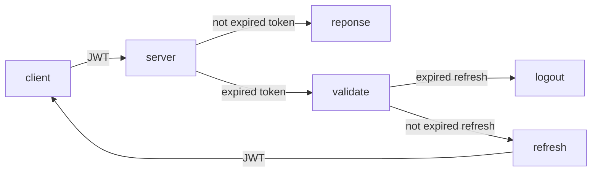

# ERD 그려가기
- ERD를 그려가며 많은 실수와 고민을 가짐
    1. SQL 테이블에서 외래/참조 키 등 개념에 대한 혼동
    2. 어떤 테이블로 구성하면 좋을지 고민

# Django 다시, 그리고 정리하기
- Django로 개발할 때, 나름 정리도 잘 되었고 이것저것 잘 기억하고 있다고 생각했다
- 다시 처음부터 시작하며 잘 기억나지 않는부분도 많았고, 이번엔 정리를 잘 해야겠다고 생각하는 계기도 가졌다

## [DRF JWT](https://jpadilla.github.io/django-rest-framework-jwt/)
- 프로젝트에 DRF JWT를 사용해야되서 찾아보았다
- 요약 : 토큰 만료 시간 + 토큰 refresh 시간
    - 너무나 간단하고, 어찌보면 서버에서 토큰 연장을 하는게 당연한데, 당시엔 수업에도 없었고, 마음도 조급해 생각하지 못했다
    - 각종 문서를 읽고 공부하는 과정이 더 중요하겠다는 생각을 가지는 시간이 되었다
- 디코딩도 가능할 것 같다
    - 만약 디코딩이 된다면, 회원정보를 추가적으로 받을 필요 없이, JWT만 받아서 서버에서 알아서 정보를 건내주면 되기때문에, FE에서는 더 간단한 로직으로 해결할 수 있으리라 생각된다
- 만약 잘 해결된다면, JWT로직은 다음과 같이 흘러갈것이다

# CS풀조
- CORS 발표 & OSI 7 layer

# Algorithm
- [BOJ 1240 노드사이의 거리 solved](https://github.com/mintropy/baekjoon_py/blob/master/1000/1200/1240.py)
    - 간단한 BFS/DFS문제
    - 트리 특성 이용하여 더 수월하게 풀이 가능